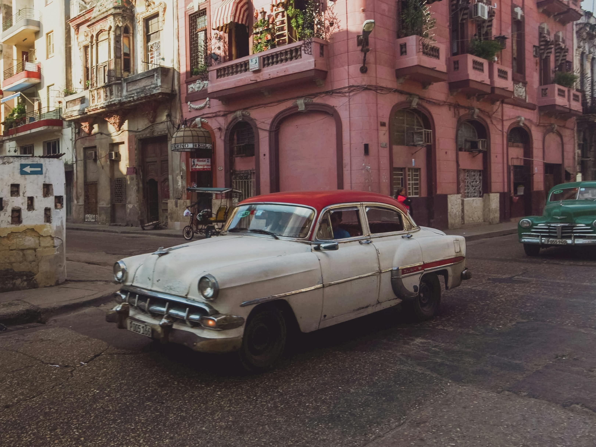

## In Cuba, self-made mechanics keep the country’s classic cars on the road, and help the economy
### [Liz Gorny](https://www.mcgrawcenter.org/stories/in-cuba-self-made-mechanics-keep-the-countrys-classic-cars-on-the-road-and-help-the-economy/)

> [!example] March 29th 2025 16:50
> [Article](https://www.itsnicethat.com/articles/apian-hives-publication-270522)
>
> #preservation #conservation #cars

>Rodríguez proudly shows off the new steering mechanism for a 1947 Nash he pieced together with metal, and Toyota and Mitsubishi parts. A 1956 Ford Fairlane gets a new Toyota engine. Rodríguez cut a 1954 Jeep in half, extended it nearly 18 inches, added Soviet-era Volga steering, and plans to get it running with a used 1994 Jetta engine — an engine already attached to a Hyundai transmission.

### Preservation Through Adaptation vs. Replication
Cuban mechanics are preserving automotive heritage not through museum-style conservation, but through practical problem-solving and creative adaptation. They're not documenting and replicating; they're evolving and extending.

## Resource Constraints as Drivers of Innovation

Cuban mechanics developed their hybrid approach due to trade embargoes and economic limitations. These constraints forced creative solutions and a deep understanding of mechanical principles rather than reliance on replacement parts.

Similarly, traditional craftspeople often developed techniques based on local material availability and limitations.

## Neo-Craftsmanship and Cuban "Neo-Automotive"

The Cuban auto mechanic culture represents a form of "neo-automotive" practice where traditional vehicles are maintained through contemporary means and hybrid approaches.