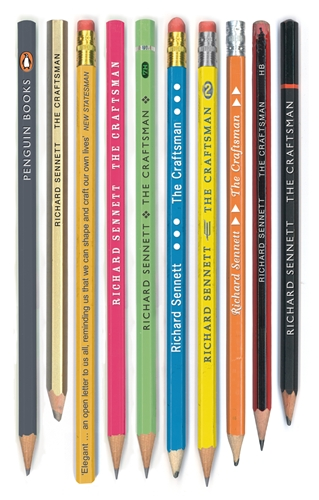

## The Craftsman 

> [!IMPORTANT]
> ==21 Oct 2025==
> The Craftsman -  **Richard Sennet**
>  ***Tags:*** #making #crafts #digital_fabrication #hci

## Definition and scope

> Craftsmanship names an enduring, basic human impulse, the desire to do a job well for its own sake.

Craftsmanship as an inherent human drive, not just a learned skill or economic necessity.

> craftsmanship cuts a far wider swath than skilled manual labor; craftsmanship focuses on objective standards, on the thing in itself.

Goes beyond manual work, includes intellectual and abstract skills. The focus is on the quality of the work itself, not external rewards.

## Obstacles to craftsmanship

> Social and economic conditions, however, often stand in the way of the craftsman's discipline and commitment: schools may fail to provide the tools to do good work, and workplaces may not truly value the aspiration for quality.

External barriers that prevent the development of craftsmanship.

> And though craftsmanship can reward an individual with a sense of pride in work,

> The craftsman often faces conflicting objective standards of excellence; the desire to do something well for its own sake can be impaired by competitive pressure, by frustration, or by obsession.

Internal and external conflicts that can undermine the craftsman's work.

## The Hand-Head Connection

> It focuses on the intimate connection between hand and head.

> conducts a dialogue between concrete practices and thinking;

The integration of physical practice and intellectual understanding.

> There is nothing inevitable about becoming skilled, just as there is nothing mindlessly mechanical about technique itself.

Skill development requires conscious effort; technique involves thinking, not just repetition.

> Western civilization has had a deep-rooted trouble in making connections between head and hand, in recognizing and encouraging the impulse of craftsmanship. _Page 9_

A cultural problem in Western thought, the artificial separation of manual and intellectual work.

## Embodied Knowledge and Imagination

> first, that all skills, even the most abstract, begin as bodily practices; second, that technical understanding develops through the powers of imagination. _Page 10_

All learning starts with physical practice; imagination is essential for developing technical skill.

> The use of imperfect or incomplete tools draws on the imagination in developing the skills to repair and to improvise. _Page 10_

Constraints and limitations actually enhance creativity and skill development.

> resistance and ambiguity can be instructive experiences; to work well, every craftsman has to learn from these experiences rather than fight them. _Page 10_

Difficulties are learning opportunities, not just obstacles to overcome.

## The Creative and Investigative Dimension

> The good craftsman, moreover, uses solutions to uncover new territory; problem solving and problem finding are intimately related in his or her mind. For this reason, curiosity can ask, "Why?" as well as, "How?" about any project. _Page 11_

Craftsmanship involves discovering new problems through solving existing ones, both understanding technique ("How?") and purpose ("Why?").

> The craftsman thus both stands in Pandora's shadow and can step out of it. _Page 11_

Reference to the myth of Pandora's box -> curiosity can be dangerous but craftsmen can channel it productively through disciplined practice.

---
### The Nature of Craftsmanship (Page 20)

What defines a craftsman isn't just technical skill, it's the dedication to quality for its own sake. The carpenter who could rush to make more money, the technician who could just pass problems along, the conductor who could just watch the clock. They all choose not to.

> "The carpenter, lab technician, and conductor are all craftsmen because they are dedicated to good work for its own sake. Theirs is practical activity, but their labor is not simply a means to another end."

This engagement with work represents something fundamental about being human. We're not just going through motions, we're _engaged_. The separation of thinking and doing damages both our understanding and our ability to express ourselves. As the text puts it: 

> "what happens when hand and head, technique and science, art and craft are separated. I will show how the head then suffers; both understanding and expression are impaired."

The really interesting point is that mastery isn't mechanical, when you truly excel at something, you can think and feel deeply about what you're doing. That's when the ethical dimensions of craft emerge.

### The Historical Shift (Page 24)

There's been a change from ancient times. Skills still keep society running, but we don't honor them the same way. 

> "The unity in archaic times between skill and community had weakened. Practical skills still sustained the ongoing life of the city but were not generally honored for doing so."

This disconnect between practical skills and social recognition seems central to understanding our modern relationship with craft.

### Open Source as Modern Craft Community (Pages 25-26)

The Linux/open source movement offers a modern parallel to traditional craft communities. There are two models: the "cathedral" (closed development, then open release) and the "bazaar" (fully open participation). The challenge mirrors ancient craft guilds: 

> "how to reconcile quality and open access."

Traditional crafts weren't static, pottery transformed with the invention of the rotating disk. Similarly, in Linux: 

> "when people squash one 'bug,' they frequently see new possibilities open up for the use of the code. The code is constantly evolving, not a finished and fixed object."

This evolution is crucial for survival. Closed knowledge systems don't last: 

> "closed knowledge-systems have tended toward short lifespans."

### The Craftsman's Relationship to Work (Page 27)

C. Wright Mills captures something essential about craft consciousness. The craftsman becomes absorbed in the work itself,  the satisfaction is intrinsic, not external. There's a mental connection between daily tasks and the final product. The craftsman has autonomy and control.

> "The laborer with a sense of craft becomes engaged in the work in and for itself; the satisfactions of working are their own reward; the details of daily labor are connected in the worker's mind to the end product"

Craft becomes a measure for everything else, family, community, politics are all evaluated through this lens of "inner satisfaction, coherence, and experiment." Work isn't separate from life; it provides the standards by which life is measured.

==Craft isn't just repetition, it's exploration within discipline. Skills develop through the process itself, not outside it.==

### The Fear of Repetition in Education (Page 38-39)

Modern education has developed an almost phobic relationship with repetition. Teachers, terrified of boring students, constantly seek new stimulation and variety. But this well-intentioned approach creates its own problem:

> "Modern education fears repetitive learning as mind-numbing. Afraid of boring children, avid to present ever-different stimulation, the enlightened teacher may avoid routine-but thus deprives children of the experience of studying their own ingrained practice and modulating it from within."

By avoiding routine, we deny students the chance to deeply examine and refine their own practice. There's something profound that happens when you repeat something enough to truly understand it from the inside.

### The Art of Practice Duration

Practice isn't just mindless repetition, it requires careful calibration. 

> "the length of a practice session must be carefully judged: the number of times one repeats a piece can be no more than the individual's attention span at a given stage."

as your skill improves, your capacity for practice without boredom actually increases. The better you get, the more you can sustain focused repetition. Those breakthrough "Eureka!" moments we all hope for? They don't come from nowhere, they're "embedded in routine."

### The Problem of Fixed Endpoints

When we treat practice as merely a path to a predetermined goal, we limit growth. 

> "When practice is organized as a means to a fixed end, then the problems of the closed system reappear; the person in training will meet a fixed target but won't progress further."

The Linux model offers an alternative, an open relationship between solving problems and finding new ones. This approach 

> "builds and expands skills, but this can't be a one-off event." It requires sustained, repetitive engagement.

### The Modern Machine Problem

We've fundamentally misunderstood what "mechanical" means. In everyday language, we equate it with static, mindless repetition. But the real threat of modern technology isn't physical replacement, it's mental separation.

> "machinery is misused when it deprives people themselves from learning through repetition. The smart machine can separate human mental understanding from repetitive, instructive, hands-on learning. When this occurs, conceptual human powers suffer."

This is different from the Industrial Revolution's threat to craftsmen. Those machines threatened to replace the craftsman's physical labor through tireless repetition. Today's machines threaten something deeper, they can prevent us from developing understanding through our own repetitive practice.

The smart machine does the learning for us, but in doing so, it robs us of the very process through which we develop deep understanding. We get the result without the journey, and our conceptual abilities atrophy as a consequence.

## On CAD and the loss of embodied knowledge

### The mental cost of screen work (Page 40)

> "when you draw a site, when you put in the counter lines and the trees, it becomes ingrained in your mind. You come to know the site in a way that is not possible with the computer."

This isn't mere nostalgia for old ways. Something happens when we physically draw, the site "becomes ingrained in the mind." The designer develops like a tennis player or musician, through deep physical involvement that matures their thinking.

There's a circular process at work here: 

> "You build up a kind of circularity between drawing and making and then back again." 

But CAD can abort this metamorphosis. Once you plot points and let algorithms do the drawing, if the system becomes closed and static, that essential circularity vanishes.

### Three failures of disembodied design (Pages 42-43)

**First, the simulation-reality disconnect.** No matter how sophisticated, 

> "Simulation is an imperfect substitute for accounting the sensation of light, wind, and heat on site." 

You can't truly understand materials or space through a screen, simulation fails as a substitute for tactile experience.

**Second, the hiding of problems.** 
> "Whereas Linux is set up to discover problems, CAD is often used to hide them." 

This capacity to "repress difficulty" partly explains CAD's commercial appeal, but it's a dangerous illusion.

**Third, overdetermination.** CAD amplifies a problem already present in blueprint design. By creating perfectly resolved forms in advance, it eliminates the 

> "crinkled fabric of buildings that allow little start-up businesses, and so communities, to grow and vibrate."

==Real vitality comes from "underdetermined structures that permit uses to abort, swerve, and evolve." But CAD's algorithms instantly generate totalized pictures, leaving no room for the incomplete or emergent.==

### Beyond hand versus machine (Page 44)

The issue isn't simply opposing manual work to technology. Modern programs can learn and expand through feedback, algorithms rewrite themselves. The real problem is human passivity:

> "The problem, as Victor Weisskopf says, is that people may let the machines do this learning, the person serving as a passive witness to and consumer of expanding competence, not participating in it."

When we separate hand from head, it's actually the head that suffers. 

> "Abuses of CAD illustrate how, when the head and the hand are separate, it is the head that suffers."

> "how to think like craftsmen in making good use of technology." 

Thinking like a craftsman isn't just a mindset, it has real social implications. We need to actively participate in our tools' capabilities rather than becoming passive consumers of their competence.

The phrase "embodied knowledge" gets thrown around a lot these days, but this goes deeper. It's about maintaining that circular relationship between thinking and doing, ensuring technology enhances rather than replaces our engagement with the physical world.

## On perfection, authority, and knowledge transfer

### The paradox of perfection (Page 46)

There's a tension between the craftsman and the practitioner. To the craftsman, every imperfection represents failure. But for the practitioner, 

> "obsession with perfection seems a prescription for failure."

This creates a kind of puzzle. You'd think that more practice would make someone more practical, more focused on what's achievable. But the opposite happens: 

> "the better your technique, the more impossible your standards."

Mastery doesn't lead to satisfaction,  it leads to increasingly unattainable goals. The more skilled you become, the more acutely you perceive imperfections invisible to others.

### Medieval workshop wtructure (Pages 57-58)

The guild system was essentially 

> "a federation of autonomous workshops, whose owners [the masters] normally made all decisions and established the requirements for promotion from the lower ranks (journeymen, hired helpers, or apprentices)."

Authority here wasn't gentle. The Latin _auctoritas_ implies someone who 
> "inspires fear and awe and so submission." Masters needed this kind of presence to maintain order.

The progression was carefully structured: seven years as an apprentice (paid for by parents), culminating in presenting a _chef d'oeuvre_ demonstrating basic skills. Success meant becoming a journeyman for another 5-10 years, until presenting a _chef d'oeuvre élevé_ to prove worthiness for mastership.

> "The apprentice's presentation focused on imitation: learning as copying. The journeyman's presentation had a larger compass. He had to show managerial competence and give evidence of his trustworthiness as a future leader."

Masters held absolute power, their "verdicts were final, without appeal." Guilds rarely interfered because the master embodied both authority and autonomy in his person.

### Authority through skill and ethics (Page 61)

Authority meant more than social position. For craftsmen, 

> "authority resides equally in the quality of his skills."

The goldsmith's case is a perfect reflection of it as good skills and authority were "inseparable from his ethics." The technological process itself (the assay) that gave goldsmithing economic value was inherently ethical. Technical competence and moral authority merged.

### Problem of knowledge transfer (Page 74)

Cellini had a critical flaw in the workshop system. He claimed that "the secrets of his art would die with him." His innovation and originality couldn't be transmitted through traditional means - the value lay in uniqueness itself.

This created a limit on the workshop's viability. In modern terms, "knowledge transfer became difficult; the master's originality inhibited the transfer." The very thing that made a master valuable, their unique insights, became what they couldn't or wouldn't share.

### The Silence of Mastery (Page 78)

In theory, workshops should balance tacit and explicit knowledge. Masters should be pushed to explain, to articulate what they've absorbed in silence. But there's a problem:

> "Much of their very authority derives from seeing what others don't see, knowing what they don't know; their authority is made manifest in their silence."

This raises an uncomfortable question: 
> "Would we then sacrifice Stradivari's cellos and violins for the sake of a more democratic workshop?" 

The master's inability or unwillingness to fully articulate their knowledge maintains their authority but limits transmission.

### The Modern Workshop Dilemma (Page 80)

The historical workshop created tight bonds through "religion and ritual." Our secular age replaced these with originality, but originality is different from autonomy. It creates "a new form of authority, an authority frequently short-lived and silent."

We're told that "Servitude through admiration or tradition must be cast off." Yet the workshop remains necessary because "there can be no skilled work without standards, it is infinitely preferable that these standards be embodied in a human being than in a lifeless, static code of practice."

The workshop can't be a comfortable home for the craftsman because it's based on personalized, face-to-face authority. But it's still a necessary home. The tension between autonomy and authority plays out here in ways we haven't fully resolved.

