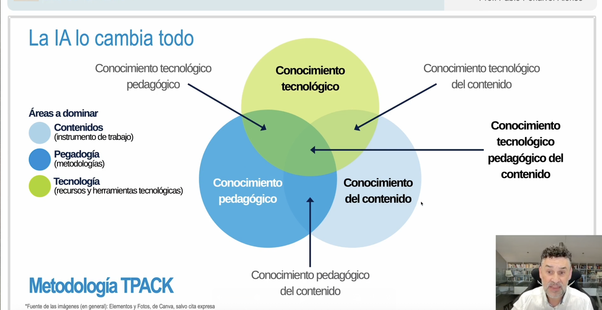

# AI usage and critical thinking developement in schools: Learning from the classroom

## Initial ideas

Differences between vocational-schools and secondary schools

AI usage: Inevitable??

How context may affect students 

Use case

AI teaching: requirements of the teacher

Conocimiento tecnológico

pedagógico

Conocimiento tecnológico

**Metodología TPACK**

énfasis en el docente (si no se entienden las aplicaciones e implicaciones no se pueden transmitir)

Gamificación a través de scape room??

