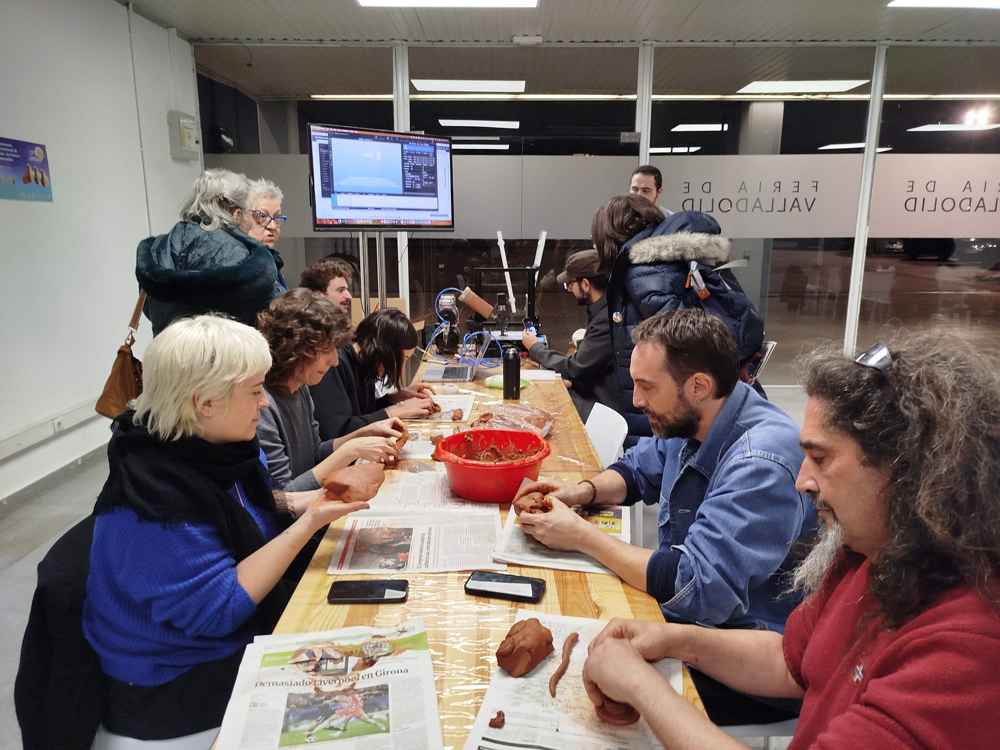
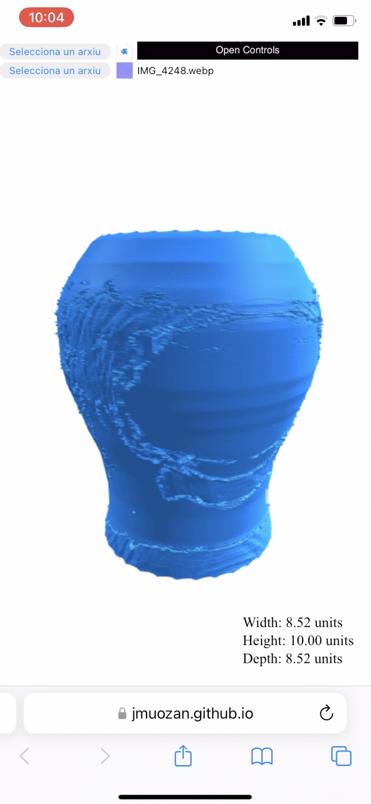
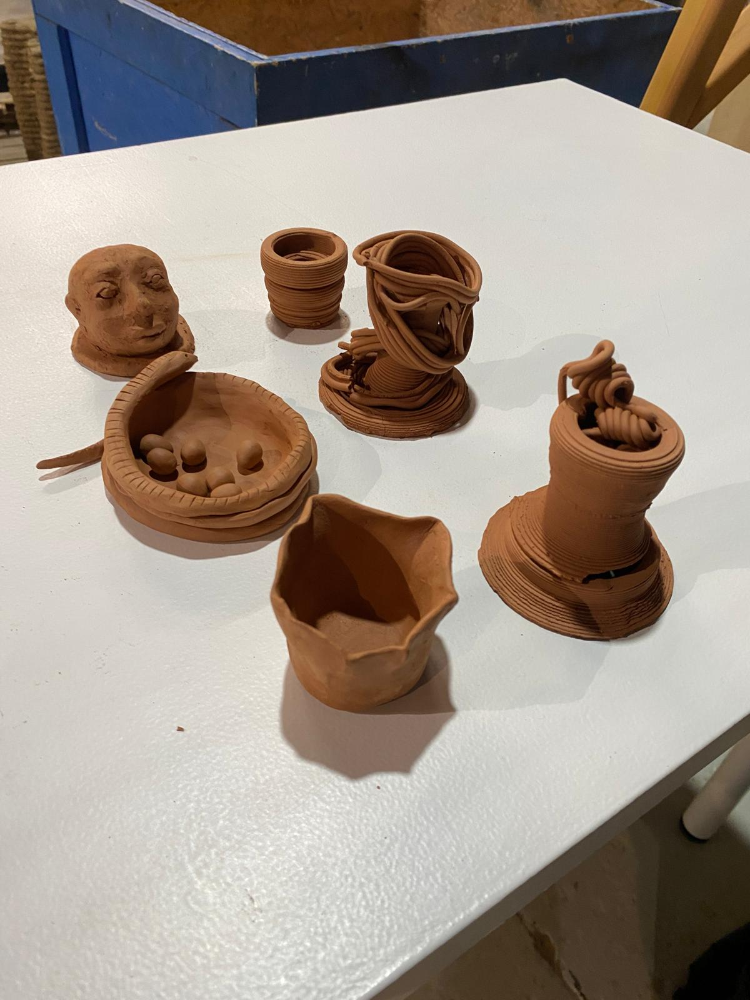

## Nuevos Métodos de Aprendizaje Artesano

> [!NOTE] March 9th 2025 18:44
> [Work](https://www.craftinnova.es/)
>
> #preservation #conservation #crafts #machine_learning #computer_vision #3d #3d_printing

## The Workshop

The workshop "Nuevos Métodos de Aprendizaje Artesano" at CRAFTINNOVA represents a practical exploration of the applications and implications of digital fabrication. In a context where personal fabrication has emerged across diverse contexts, the workshop created an encounter between craftsmans and digital fabrication tools (beign used in this case the clay printer). This meeting was designed not as a confrontation between old and new, but as a dialogue and an exploration into how digital tools can authentically extend rather than replace the craft tradition.

The central question that emergedwas the following:
***If craftsmanship's essence lies in the creative problem solving process, how can digital fabrication tools become active participants in it rather than automation devices?*** 
Trying to apply personal fabrication as a means of empowerment rather than mere efficiency, the idea of the workshop was to approach digital tools not primarily to replicate what artisans already knew how to make, but to expand their creative possibilities.

## Digital

To preserve the intuitive, embodied nature of craft practice, a web app was developed allowing participants to sketch on their phones using touch input. This approach looked to acknowledge that the craft requires a connection between hand and head, addressing a fundamental limitation of conventional design tools. Even sophisticated CAD systems fail to express imperfection, what caracterizes the craft. By creating a workflow that began with tactile sketching and ended in material engagement, the activity explored how technology can contribute to craft preservation not merely through documentation, but by becoming integrated into evolving craft practice itself.

## Materiality

Observing and interviewing the different artisans to know how each of them related to digital tools on their work process showed the different dimensions and depth of the applications of digital fabrication in the crafts context having diverse answers. For some of the artisans, this activity, did not present anything new besides a new exploration but for others it represented a way to expand literacy, both digital and material, by creating new interactions between artisan, material, and tool. 

The clay printer, despite its digital control system, interacts with clay according to the same physical principles that rule the hand techniques. Clay maintains its material properties regardless of whether it is shaped by hand or extruded through a mechanical nozzle. This materiality creates a productive constraint; Participants in the workshop encountered the clay printer's limitations and possibilities as a new set of material constraints to navigate, drawing on their traditional knowledge while developing new skills specific to the printer.

This experience exemplifies what Gershenfeld (2007) describes as the convergence of "industrial production... with personal expression, which would merge with digital design, to bring common sense and sensibility to the creation and application of advanced technologies." The clay printer doesn't eliminate the need for craft knowledge, it just transforms how that knowledge is applied.

## Neo-Craftsmanship in Practice

The workshop explored the concept of "neo-craftsmanship" trying to exemplify how digital tools can be integrated into craft practice not as replacements for traditional methods but as extensions of them. The comparison between hand built pieces and those created through the clay printer wasn't framed as a competition between methods but as an exploration of their complementary strengths.

This approach explored the "black-or-white" thinking that has characterized discussions of technology and craft since the Industrial Revolution. By engaging directly with questions of creativity, expression, and technical skill, the workshop challenged this historical division, suggesting that digital fabrication might help heal this artificial separation by reuniting conception and execution in a single creative process.

## Conclusion

By creating a dialogue between traditional craft knowledge and digital fabrication capabilities, the workshop points toward a future where, as Gershenfeld puts it, "just as accumulated experience has found democracy to work better than monarchy, this would be a future based on widespread access to the means for invention rather than one based on technocracy."

The clay printer becomes not just a tool but a participant in this dialogue, presenting its own challenges and possibilities, requiring new skills while building on traditional knowledge. This relationship between craftsperson and tool exemplifies what sociologist Richard Sennett describes as "a constant dialogue between concrete practices and thinking," where obstacles and resistances develop rather than diminish craft practice.

In this way, the workshop demonstrates that the essence of craftsmanship can survive and even thrive in the digital age. Not despite but because of the new tools and methods that expand the craftsperson's creative possibilities while preserving their essential connection to materials, process, and meaning.

> [!abstract] Directly Related Readings
> [_The Craftsman_.](The_Craftsman.md) 
> [AI.RTISANSHIP](AI.RTISANSHIP.md)
> [FAB](../Books/Fab.md)

